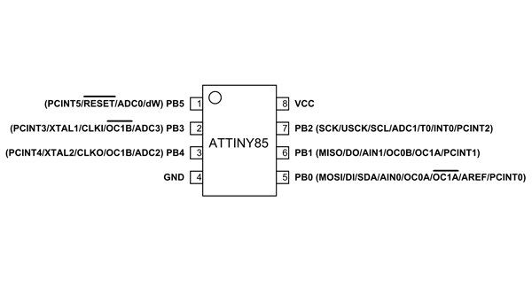

# irkiosk-i2c-reset

This sketch is designed to power-cycle the RFID modules further down the I2C bus.
It has the address `0x55`, and when it receives a command, it uses the MOSFET on board to cut ground
on devices further down the bus for 20 ms. It doesn't do anything else.

## programming

The simplest way to load this sketch onto and ATTiny85 is to use another Arduino as programmer. To do so,
burn the `Examples > 11.ArduinoISP > ArduinoISP` sketch onto your Arduino. Then connect your Arduino's
5V, GND, MISO, MOSI, and SCK pins to the matching pins on the ATTiny85.

Make sure you have [ATTinyCore installed](https://github.com/SpenceKonde/ATTinyCore/blob/v2.0.0-devThis-is-the-head-submit-PRs-against-this/Installation.md) (which, it should be noted, currently only works in the legacy IDE). Set your board to 
`Boards > ATTinyCore > ATTiny25/45/85 (no bootloader)`. Set the programmer to `Programmer > Arduino as ISP`, and select 
the correct port for your Arduino.

Finally, click `Tools > Burn Bootloader`. When that's done, you can upload your code as normal.
