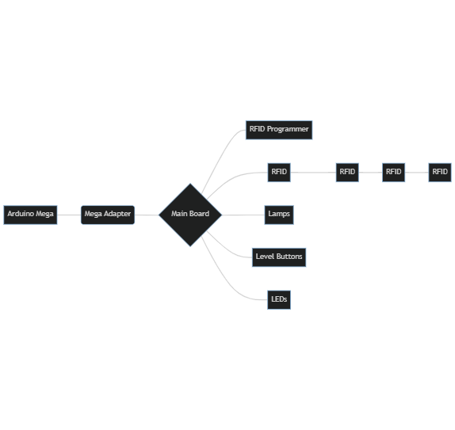

Iowa Science Rover - Electronics
================================

Due to the myriad inputs and outputs that need to be managed, the electronics of the kiosk have been split into
a constellation of connected boards rather than using a single monolithic board. The scheme of connections is
as follows:

[

The Arduino Mega connects to the main board via the adapter board and 40-pin ribbon cable. The main board powers
all the other boards with both 12V from the primary power supply and 5V from an on-board regulator. It also carries
the communications radio and the ATTiny84 required for the RFID programmer's RFID reader.

(The dotted line between the lamps and level buttons boards represents the fact that they share a serial data line
internally on the main board).
